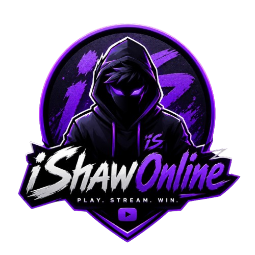

# Meet Shawon

### Cybersecurity, Software Development & Technical Projects

A full-stack professional portfolio and community platform created by 
**Md Samsudduha Shawon**.

 

 

[Live Platform](https://meetshawon.com) ·
[Projects](https://meetshawon.com/projects) ·
[Technical Blog](https://meetshawon.com/blog) ·
[Certifications](https://meetshawon.com/certifications)

---

## About the Project

**Meet Shawon** is a production-deployed professional portfolio and community platform focused on cybersecurity, ethical hacking, software development, infrastructure, and continuous technical learning.

The project originally began as a personal portfolio but has since developed into a broader full-stack platform combining professional presentation, technical publishing, community interaction, account management, moderation, and private-cloud access.

It provides a central place to document my:

- Cybersecurity learning journey
- Software and infrastructure projects
- Technical skills
- Professional qualifications
- Certifications and credentials
- Research and technical writing
- Practical development experience

The platform is continuously improved as my technical knowledge, projects, and professional experience progress.

---

## Platform Preview

---

## Project Objectives

The principal objectives of this project are to:

- Build a professional and credible online presence
- Document practical cybersecurity and software projects
- Publish technical articles and learning notes
- Demonstrate modern full-stack development
- Explore secure authentication and access control
- Support controlled community interaction
- Integrate software with self-hosted infrastructure
- Apply security-conscious development practices
- Create a platform capable of evolving over time

---

## Platform Areas

### Professional Portfolio

The portfolio introduces my professional background, education, skills, certifications, projects, career direction, and current areas of learning.

It includes dedicated areas for:

- About and professional journey
- Cybersecurity and technical skills
- Project case studies
- Certifications and education
- Resume and career overview
- Professional contact information

### Technical Publishing

The publishing platform supports structured technical articles covering areas such as:

- Cybersecurity
- Ethical hacking
- Networking
- Linux and systems
- Software development
- Self-hosted infrastructure
- Project documentation
- Technical learning and research

Articles can include categories, tags, cover images, Markdown content, estimated reading time, related content, and engagement information.

### Community Experience

Registered members can participate in the platform through features such as:

- Personal accounts
- Public profiles
- Article reactions
- Comments and discussions
- Saved articles
- Notification preferences
- Profile customisation
- Newsletter subscriptions

### Administration and Moderation

The platform includes role-aware administration and moderation capabilities for managing content, accounts, publishing activity, and community participation.

These features support the responsible operation and continued development of the platform.

### Private Drive

Meet Shawon also provides the web gateway for a self-hosted private-cloud project.

The Drive project explores the relationship between:

- Web applications
- User identity
- Controlled access
- Automated provisioning
- Self-hosted storage
- Secure remote connectivity

The underlying infrastructure is developed as a separate technical project while being integrated into the wider Meet Shawon platform.

---

## Featured Projects

### Professional Portfolio Platform

A production-deployed full-stack portfolio and community platform combining professional content, technical publishing, user accounts, community interaction, administration, moderation, and private-cloud integration.

**Status:** Active development

### Self-Hosted Private Cloud Infrastructure

A private-cloud and NAS platform focused on resilient storage, separated user access, remote connectivity, monitoring, automation, and recovery planning.

**Status:** Operational and continuously maintained

### Cybersecurity Home Lab

A controlled learning environment for developing practical experience with Linux, networking, virtualisation, traffic analysis, security tools, and authorised ethical-hacking exercises.

**Status:** In progress

More information is available on the [Projects page](https://meetshawon.com/projects).

---

## Technology Overview

The platform uses a modern full-stack technology ecosystem.

| Category | Technologies |
|---|---|
| Application framework | Next.js and React |
| Programming language | TypeScript |
| Styling | Tailwind CSS |
| Authentication and data | Supabase |
| User interface | Framer Motion and Lucide |
| Content rendering | React Markdown and Highlight.js |
| Email communication | Resend |
| Monitoring | Sentry |
| Hosting | Vercel |
| Infrastructure | Docker, Linux, TrueNAS SCALE and ZFS |
| Automation | GitHub Actions and Dependabot |
| Version control | Git and GitHub |

The technology stack may evolve as the platform’s requirements and capabilities expand.

---

## Current Capabilities

### Portfolio

- [x] Responsive professional homepage
- [x] About and career journey
- [x] Dedicated technical skills area
- [x] Project portfolio and individual case studies
- [x] Certifications and education
- [x] Resume presentation
- [x] Professional contact experience
- [x] Search-engine and social-sharing metadata

### Accounts and Profiles

- [x] Account registration and authentication
- [x] Account recovery
- [x] Profile management
- [x] Profile images and cover themes
- [x] Public member profiles
- [x] Account activity
- [x] Notification preferences
- [x] Saved content
- [x] Account security controls

### Publishing and Community

- [x] Technical article publishing
- [x] Markdown article rendering
- [x] Categories and tags
- [x] Article search and filtering
- [x] Related and popular articles
- [x] Article view tracking
- [x] Reactions
- [x] Comments
- [x] Bookmarks
- [x] Sharing tools
- [x] Newsletter subscriptions

### Platform Management

- [x] Administrative dashboard
- [x] Article management
- [x] User management
- [x] Comment management
- [x] Content moderation
- [x] Account restriction workflows
- [x] Moderation history
- [x] User appeal workflow
- [x] Platform health monitoring

### Infrastructure

- [x] Production deployment
- [x] Monitoring and error reporting
- [x] Automated dependency monitoring
- [x] Container-image automation
- [x] Self-hosted storage platform
- [x] Private Drive access gateway
- [x] Automated storage provisioning foundation

---

## Roadmap

The roadmap represents the current direction of the project and may change as development progresses.

### Phase 1 — Portfolio Foundation

- [x] Establish the visual identity
- [x] Build the core portfolio pages
- [x] Add responsive layouts
- [x] Present projects and skills
- [x] Publish certifications and resume
- [x] Configure production deployment

### Phase 2 — Identity and Accounts

- [x] Introduce account registration
- [x] Add authentication and account recovery
- [x] Create profile-management features
- [x] Add public member profiles
- [x] Introduce role-aware platform access
- [x] Add notifications and account activity

### Phase 3 — Publishing Platform

- [x] Build the technical blog
- [x] Add structured article publishing
- [x] Support Markdown content
- [x] Add categories and tags
- [x] Introduce search and filtering
- [x] Add article analytics and discovery

### Phase 4 — Community Features

- [x] Add article reactions
- [x] Add comments and discussions
- [x] Add article bookmarks
- [x] Add content-sharing tools
- [x] Introduce newsletter subscriptions
- [x] Develop member-facing notifications

### Phase 5 — Administration and Moderation

- [x] Build the administration dashboard
- [x] Add content-management workflows
- [x] Add user-management capabilities
- [x] Introduce community moderation
- [x] Add restriction and appeal workflows
- [x] Record moderation activity

### Phase 6 — Private Cloud Integration

- [x] Build the self-hosted storage foundation
- [x] Establish secure remote connectivity
- [x] Introduce authenticated Drive access
- [x] Develop automated provisioning
- [x] Add administrative Drive controls
- [ ] Continue Drive integration testing
- [ ] Improve service resilience and recovery workflows
- [ ] Expand user-facing Drive functionality

### Phase 7 — Quality and Expansion

- [ ] Expand automated testing
- [ ] Perform extended accessibility reviews
- [ ] Continue performance optimisation
- [ ] Expand technical documentation
- [ ] Publish additional project case studies
- [ ] Add cybersecurity home-lab reports
- [ ] Expand technical and research content
- [ ] Continue platform security reviews

---

## Development Status

Meet Shawon is an actively maintained personal project.

| Area | Status |
|---|---|
| Professional portfolio | Stable |
| Authentication and profiles | Active |
| Technical publishing | Active |
| Community features | Active |
| Administration | Active |
| Moderation | Active |
| Private Drive | Active development |
| Cybersecurity home lab | In progress |
| Automated testing | Planned expansion |
| Technical documentation | Continuously updated |

Features may be introduced, redesigned, temporarily disabled, or improved as the platform develops.

---

## Design Principles

### Security Consciousness

Security considerations are included throughout the project’s design and development process. The platform is also used as a practical environment for learning more about secure application architecture and responsible platform operation.

### Privacy

Personal information and account data are handled with privacy in mind. Only information intended for public presentation is displayed through the portfolio and public-profile features.

### Accessibility

The platform aims to provide clear navigation, readable content, responsive layouts, semantic structure, keyboard usability, and consistent visual feedback.

### Performance

Performance is considered through modern rendering, image optimisation, reusable components, efficient content delivery, and production monitoring.

### Maintainability

The codebase is structured around reusable components, typed application logic, organised feature areas, and consistent development practices.

### Continuous Improvement

The project evolves alongside my education, cybersecurity training, technical projects, and professional development.

---

## Responsible Use

This repository is intended for:

- Portfolio presentation
- Professional evaluation
- Educational reference
- Technical learning
- Development experimentation
- Constructive collaboration

Any cybersecurity-related material associated with this project is intended exclusively for lawful, authorised, and ethical use.

No part of this project should be used to gain unauthorised access to systems, accounts, networks, services, or data.

---

## Feedback and Contributions

Meet Shawon is primarily a personal platform, but constructive feedback and responsible contributions are welcome.

Useful contributions may include:

- Accessibility improvements
- Documentation corrections
- User-experience suggestions
- Performance recommendations
- Responsible security observations
- General code-quality improvements

For significant changes, opening an issue before submitting a pull request is recommended.

---

## Licence

This project is available under the [MIT Licence](./LICENSE).

Copyright © 2026 **Md Samsudduha Shawon**.

The MIT Licence applies to the software contained in this repository. Personal information, written portfolio content, branding, photographs, certificates, resume documents, and other personal assets remain the property of their respective owners and should not be reused as another person’s identity or portfolio content.

---

## Connect

 

Built and maintained by **Md Samsudduha Shawon**

[Return to top](#meet-shawon)

